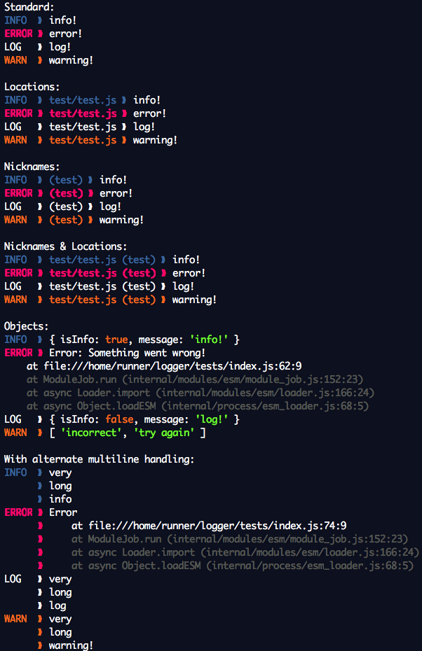

# doinkythederp's Logger module

A module for making console logs prettier.

Makes `.error`, `.warn`, and `.info` actually look different than `.log`.

```js
import Logger from "@doinkythederp/logger";

const logger = new Logger();

logger.log( ["Started!", "and another message"] );
logger.info("I just logged something.");
logger.warn("An error is coming!");
logger.error(new Error("Oops!"));
```

## Config:

```js
import Logger from "@doinkythederp/logger";

// All of these settings are optional, and aren't needed for the module to work properly.

const options = {

	location: "file location, e.g. 'src/index.js'. You could also pass in __filename which will be automatically trimmed",

	name: "The nickname of what is doing the logging, e.g. 'startup' or 'Error Handling'",

	doMultiline: true, // Enable alternate multiline handling

	console: global.console // Console-like to be used by the module. Must have error, log, warn, and info methods.

}

const logger = new Logger(options);

logger.log("hello!");

delete logger.options;
logger.log("hello again!", { name: "Greeter" })
```

## Example:


___
After making an edit to `index.ts`, use this command to compile: 
```bash
tsc ts/index.ts --outDir src/ -d -t es2020 -m es2020
```